# 🏥 AI Elderly Health Companion

## 🚩 Problem Statement
As the global population ages, two critical issues have emerged:
1.  **Health Literacy Gap**: Elderly individuals often struggle to understand complex medical data (e.g., "Is 130/90 BP bad?"). Traditional health apps are too technical and dashboard-heavy.
2.  **Isolation & Anxiety**: Managing health conditions alone can be stressful and lonely. Seniors need reassurance and a friendly presence, not just cold numbers.
3.  **Delayed Intervention**: Abnormal vital signs often go unnoticed until it's too late because users don't know how to interpret the early warning signs.

## 💡 Our Solution
The **AI Elderly Health Companion** is a smart, empathetic, and accessible web application designed specifically for seniors. It bridges the gap between medical data and human understanding.

Instead of just showing charts, our AI **talks** to the user. It explains health data in simple, warm language, provides personalized advice, and acts as a vigilant guardian that alerts users to potential health risks immediately.

## 🏗️ Architecture

The project follows a modern, decoupled architecture designed for scalability and ease of deployment (e.g., on Google Cloud Platform).

```mermaid
graph TD
    User[👴 User / Browser] <-->|HTTP/REST| Frontend[💻 Web Frontend]
    Frontend <-->|API Calls| Backend[⚙️ FastAPI Backend]
    Backend <-->|Query/Store| DB[(🗄️ SQLite Database)]
    Backend <-->|Prompt/Response| AI[🧠 Google Gemini AI]
    
    subgraph "Core Components"
        Backend
        DB
        AI
    end
```



### 🛠️ Tech Stack
*   **Frontend**: Vanilla HTML5, CSS3, JavaScript (Lightweight, fast, and accessible).
*   **Backend**: Python 3.9+ with **FastAPI** (High-performance async API).
*   **AI Engine**: **Google Gemini** (via `google-generativeai` SDK) for natural language understanding and medical context awareness.
*   **Database**: **SQLite** (with SQLAlchemy ORM) for reliable, serverless data storage.
*   **Containerization**: Docker (Ready for Cloud Run deployment).

## ✨ Key Features

### 1. 🤖 Empathetic AI Companion
*   **Natural Conversation**: Users can ask "How is my heart?" or "What should I eat?" and get friendly, human-like answers.
*   **Context Awareness**: The AI knows the user's name and recent health history. It doesn't just give generic definitions; it interprets *their* specific data.
*   **Smart Advice**: Provides specific management tips for Heart Rate, Blood Pressure, Glucose, SpO2, and Temperature.

### 2. 📊 Simplified Health Dashboard
*   **Clear Vitals**: Large, easy-to-read cards for Heart Rate, Blood Pressure, SpO2, Glucose, and Temperature.
*   **Visual Status**: Instantly shows if a reading is "Normal" (Green) or "Abnormal" (Red).
*   **Weekly Trends**: Simple bar charts to track progress over the last 7 days.

### 3. 🚨 Intelligent Alert System
*   **Real-time Monitoring**: Automatically flags dangerous values (e.g., High BP, Low Oxygen).
*   **Instant Feedback**: The AI warns the user immediately in the chat and advises them to see a doctor.
*   **History**: Keeps a log of recent alerts for caregivers to review.

### 4. ⚙️ Simulation & Testing
*   **Auto-Simulation**: Built-in tool to generate random health data to demonstrate the app's capabilities.
*   **Manual Input**: Allows users (or testers) to input specific values to test how the AI reacts to different health scenarios.

## 🚀 How to Run

### Prerequisites
*   Python 3.9+
*   Google Gemini API Key

### Steps
1.  **Clone the repository**
2.  **Install Dependencies**:
    ```bash
    pip install -r adk-agent/requirements.txt
    ```
3.  **Configure Environment**:
    Create a `.env` file in `adk-agent/` with your API key:
    ```
    GEMINI_API_KEY=your_api_key_here
    ```
4.  **Run the Backend**:
    ```bash
    python adk-agent/main.py
    ```
5.  **Open the Frontend**:
    Open `frontend/index.html` in your web browser.

## 🔮 Future Roadmap
*   **Voice Integration**: Allow users to speak to the AI instead of typing.
*   **Wearable Sync**: Connect directly to smartwatches (Fitbit, Apple Watch) for automatic data ingestion.
*   **Caregiver Portal**: A separate login for family members to view alerts remotely.
